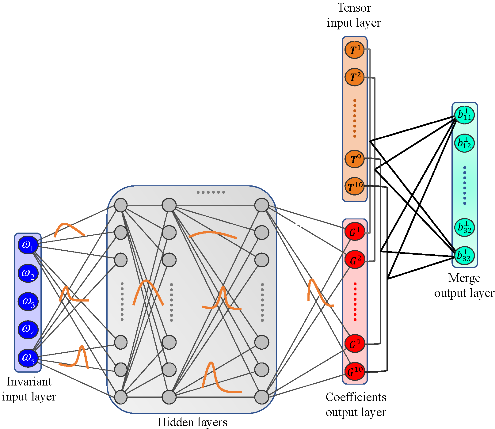

# BNNRANS

The past few years have witnessed a renewed blossoming of data-driven turbulence models. Quantification of the
concomitant modeling uncertainty, however, has been mostly omitted, and the generalization performance of the
data-driven models is still facing great challenges when predicting complex flows with different flow physics not seen
during training. A robust data-driven Reynolds-averaged turbulence model with uncertainty quantification and non-linear
correction is proposed in this work with the Bayesian deep neural network. In this model, the Reynolds stress tensor is
decomposed into linear and non-linear parts. The linear part is taken as the usual linear eddy viscosity model while the
non-linear counterpart is learned by a Bayesian deep neural network. Independent tensor bases of invariants and tensors
constituted by mean strain rate tensor and rotation rate tensor are embedded into the neural network to effectively
consider key turbulence features in different flows. The proposed model is well validated through numerical simulations
of four canonical flows that significantly deviate in geometrical configurations and/or Reynolds numbers from those in
the training data. With the non-linear corrections of embedded invariants and tensors representing key features of
turbulence, the proposed model not only improves the predictive capabilities of Reynolds-averaged turbulence models on
the same mesh but also has better generalization performance when simulating complex turbulent flows with large scale
separation. In addition, this model allows to quantitatively demonstrate the confidence interval of the predicted flow
quantities that are originated from the model itself.

The framework utilized in the present work for formulating data-driven turbulence model is shown below:

It is shown that the built model can improve the RANS predictions:

# Prerequisite

Ubuntu 20.04, OpenFOAM-7, Python 3.7, PyTorch 1.7, libtorch 1.7

# Utilizing neural network model with OpenFOAM

See [this file](./bnn_OpenFOAM/ReadMe.md) for using PyTorch neural network model with OpenFOAM, please.

# Using docker

I have prepared a docker image with all libraries and solvers installed. You can download it
[here](https://pan.nuaa.edu.cn/share/1bc46f5f08f754530a5ca0af61?lang=en). For the usage of docker, you can get some
something useful [here](https://github.com/thw1021/Cylinder2DFlowControlGeneral).

*Note*: I changed the OpenFOAM source code when doing this work. The best way is to leave the OpenFOAM source code as it
is and [compile the source files as user libraries and
solvers](https://doc.cfd.direct/openfoam/user-guide-v7/compiling-applications).

# Acknowledge

This work is based on [rans-uncertainty](https://github.com/cics-nd/rans-uncertainty). Thank Dr. Nicholas Geneva for sharing the code and data.

# References

Dr. Andre Weiner has written very good [tutorials](https://ml-cfd.com/) for using OpenFOAM with PyTorch and Docker.

# Help

If you encounter problems, feel free to open an issue. You can also email me (thw1021@nuaa.edu.cn, Hongwei Tang).

